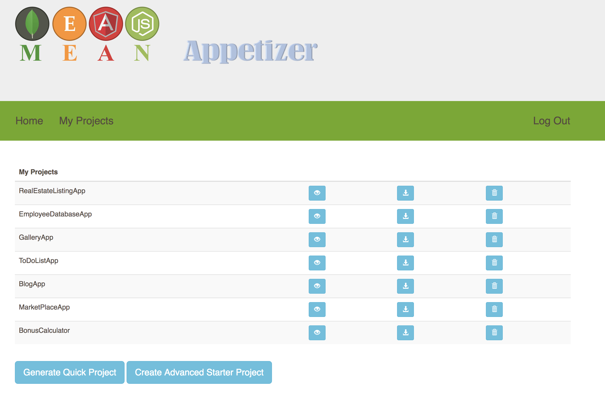
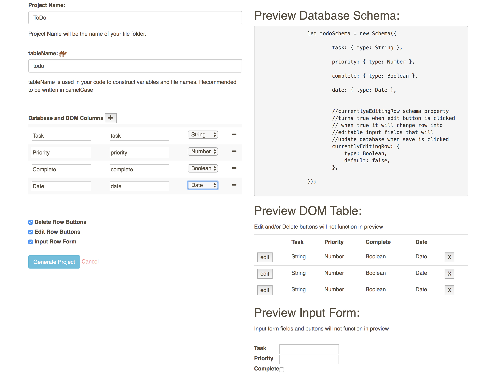
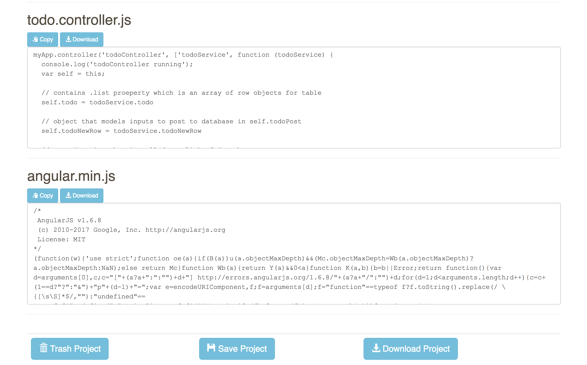

# Mean Appetizer

## Created by Brandon Yapel

### Overview
The MEAN Appetizer is an app to improve efficiency and improve start up time for MEAN Stack
Developers. It will allow developers to fill out an input form to generate a baseline project that
they will be able to edit, download, or copy code from to get started on a code project.

### Built With
Postgres SQL
Express
Angular
Node.js
MongoDB
FileSaver.js
JSZip
Passport-local 

### Getting Started

#### Prerequisites
Node.js
mongo
SQL

#### Installing

teps to get the development environment running.

Download this project.
``` npm install ```
``` npm start ```

## Screen Shots





## Documentation

### Features
[X]Feature-Registration using passport

[X]Feature-User Home Page with projects

[X]Feature- NewProject Ability to create new 
project

[X]Feature-Blank project ability to generate pure baseline project infrastructure

[X]Feature-Input form for table project

[X]Feature-Database created for inputtable code.

[X]Feature-Concat inputs and database code into formatted code strings

[X]Feature-Codeblocks create code blocks with generated code, 

[X]Feature-ability to copy code in code block for all

[X]Feature-ability to edit code in code block for all

[X]Feature-ability to download file for code block

[X]Feature-abitlity to download entire project into zip file.

[X]Feature-Preview generate a preview of database and DOM that can be seen by person inputting on form

[X]Feature table to DOM

[ ]Feature list to DOM

[ ]Feature custom HTML to DOM

[ ]Feature-authentication option for generated 
project

[X]Feature-edit button for row input option

[X]Feature-delete button

[ ]Feature-toggle button

[ ]Feature-unit tests

[ ]Feature-CSS presets

[ ]Feature-upload favicon.ico

[ ]Feature-FileStack upload images

[ ]Feature-add multiple views

[ ]Feature-use Github API for login

[ ]Feature-post project to Github


## Deployment
This project is currently not deployed.  The app runs using a Postgres SQL database.  The database.sql file is currently incomplete since the database.  I intend deploy a live version of this app by May 2018.

## Author

Brandon Yapel

## Acknowledgements

Thank you to Prime Digital Academy for teaching me how to code in their Full Stack Engineering Bootcamp.  I dreamed up this project for my Individual/Thesis Project for the Bootcamp.  I intend to continue my developing this app and making it available to assist students of Prime to fullfill their dreams of creating full stack apps.